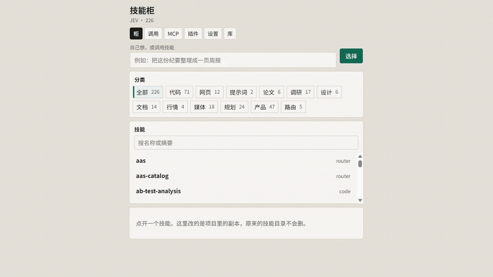
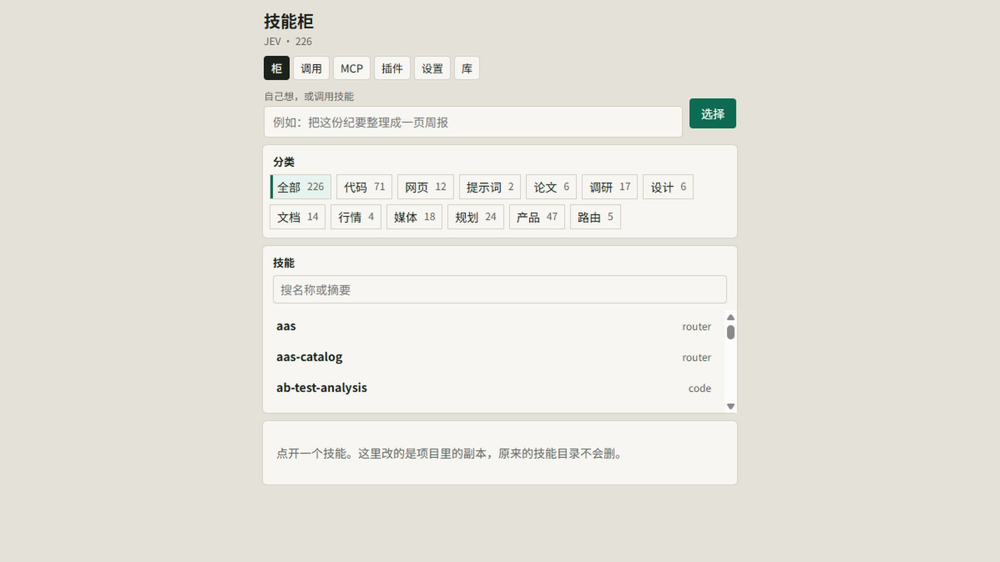
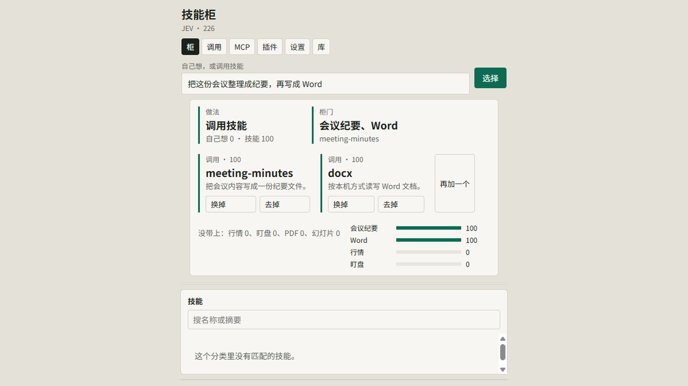
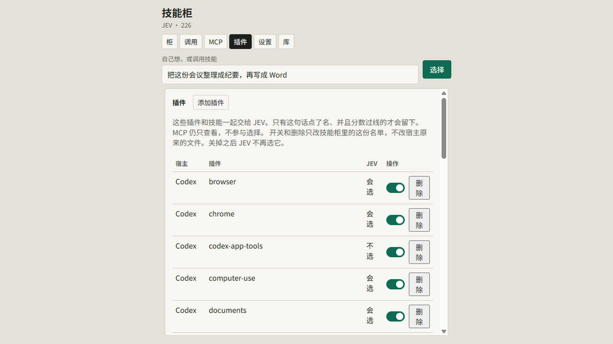
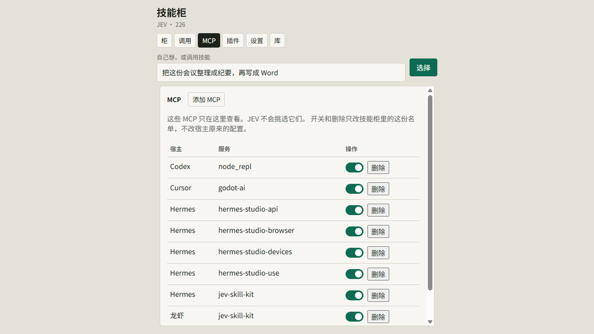
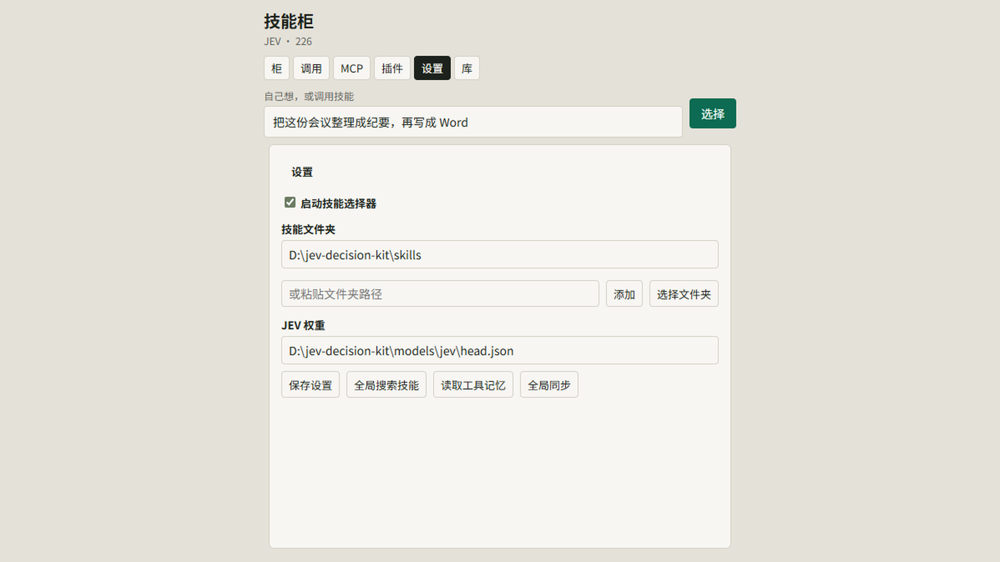
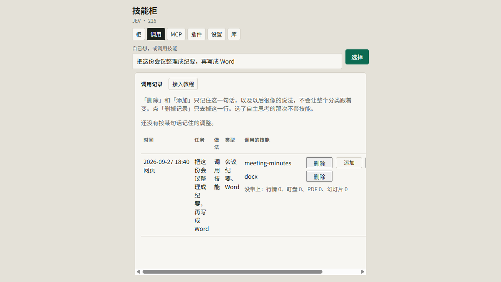
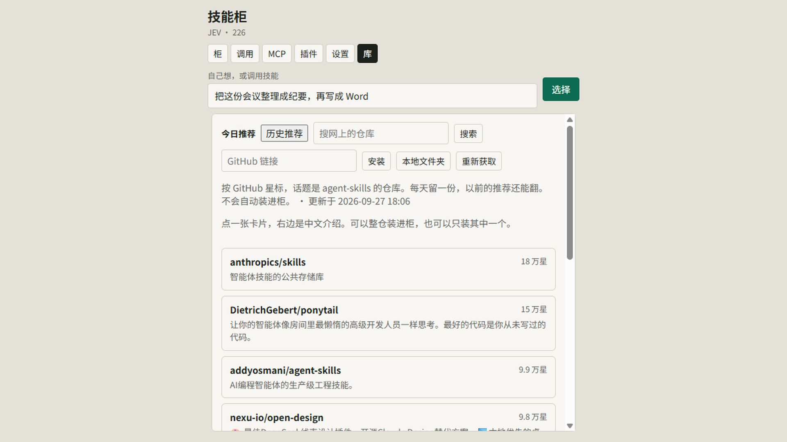

# 技能柜

本地技能柜。它把你机器上已有的技能复制进这个项目。每一句话先交给本机的 JEV 打分。柜门上每一项单独问要不要用。句子里写了这项、并且过线的都留下；写了不要的那项除外。一份都不要就自己做。模型打开时结果已经定好，它照做，不再挑选。原来的技能目录不会删除。

JEV 选的是技能和能点名的插件。MCP 只在柜子里查看和管理，不参与挑选。

技能副本、调用记录和个人配置都留在本机，不在这个仓库里。仓库里有选择器权重 `models/jev/head.json`。

## 展示

走一遍柜子（1920×1080）：



GitHub 点开 `docs/tour.mp4` 不会播，这是网页文件页的限制。要看 mp4：下载后用播放器打开，或把 [docs/play-tour.html](docs/play-tour.html) 和 `tour.mp4` 放在一起用浏览器打开。完整介绍片仍是本机 `jev-skill-kit-intro.mp4`，约 44MB，网页预览打不开。















## 运行

```bash
python -m venv .venv
.venv\Scripts\python -m pip install -r requirements.txt
.venv\Scripts\python web\server.py
```

打开 <http://127.0.0.1:8765/>。选择器读 `models/jev/head.json`。重新训练用 `.venv\Scripts\python -m host.train_jev`。

## 别人的技能在哪

知道技能文件夹在哪，就在设置里选它或粘贴路径。程序把里面的技能复制进项目，原来的文件夹不删。

不知道在哪，再点「全局搜索技能」。它会查找常见的 Cursor、OpenClaw、Hermes、Codex、Claude 技能目录，以及用户主目录里的项目。同名的只保留一份。

## JEV

选择器是本机训出来的门打分头，不调用 Laya。

- 权重：`models/jev/head.json`。这是已发布的基线，不要假设 `python -m host.train_jev` 会得到同一份文件。样本表可以比权重新。
- 训练：`.venv\Scripts\python -m host.train_jev`。训完会跑回归集，只有集合匹配不下降才写入权重。要强行覆盖用 `--force`。
- 样本按柜门上的说法来写。`tests/eval_cases.json`、`tests/eval_blind.json` 和十二句考卷都不放进训练集；修召回用近义句，不用评测原句

## 调用记录

每次选择都会记下任务、类型和用到的技能。在结果上或「调用」里可以：

- 去掉或换掉一个技能：只记住这一句话，以及以后很像的说法。不会让整个分类都跟着变
- 再加一个技能：同样只记在这句话上
- 删掉记录：只去掉这一行，已经记住的调整还在

换一种说法、意思接近时，也会沿用这次调整。结果上会写明沿用了哪一句。

JEV 在模型开口之前打一遍分。门上每一项单独问要不要用，例如行情、文件、浏览器、介绍视频、论文。句子里写了这项、并且过线的一起留下。写了不要的那项除外。只教模型怎么想的技能留在柜子里，不进这道题。

- 自己做：这次不读技能
- 调用技能：读完选定的那几份，照做，不再挑选

## 接入

别人要把自己的宿主接到这个柜上，按 [INTEGRATION.md](INTEGRATION.md) 做。模型开口之前把原句交给柜，柜返回已经定好的结果。网页上的 MCP 配置只用来读取已经选定的技能正文，不能用来挑选。

## 技能库

「库」里每天从 GitHub 取星标最高、话题是 agent-skills 的 10 个仓库。只是推荐，不会自动安装。

推荐在页面最上。仓库名和里面的技能都能点开原链接。贴 GitHub 链接的输入框在标题那一行。柜会把里面的 SKILL.md 复制进来，不运行脚本。龙虾和 Hermes 已经接在这个柜上时，下次任务直接用这份副本。

## 龙虾、Hermes、Codex、Harness

Hermes 用 `pre_llm_call`，龙虾用 `before_prompt_build`，在模型开口前要这段前言。关掉选择器后，它们不再把这句话交给 JEV。

Codex 和 DeepSeek Harness 目前走 MCP 补读：把 `jev-skill-kit` 加进各自的 MCP 列表，`get_skill` 必须带前言里的 `decision_id`。它们还没有和 Hermes 一样的开口前钩子，所以完整「先选再开口」仍要宿主自己接 [INTEGRATION.md](INTEGRATION.md) 里的前言服务。打开网页不会改这些宿主的配置；只有在设置里点保存时才会同步 Hermes 和龙虾的 MCP 读写项。
