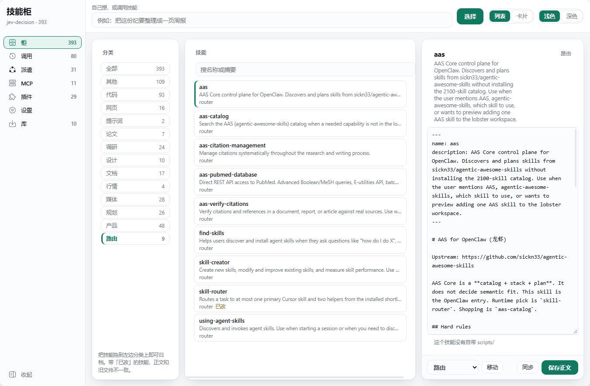
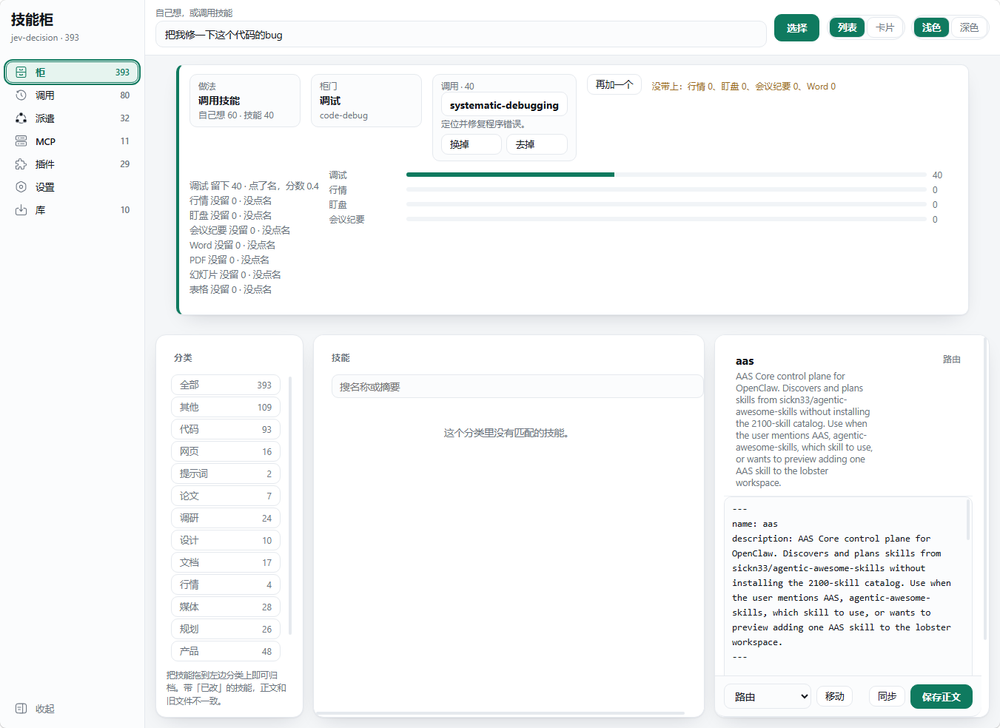

# 技能柜

本机先决定用哪些技能和插件，再让对话模型开口。[jev-decision](https://github.com/kdcadmin/jev-decision-kit) 只做这一件事：看你的原句，选出「自己做」或几份技能 / 插件。网页柜用来浏览、整理、从网上的 skill 仓库安装；它不替模型挑选。

仓库：https://github.com/kdcadmin/jev-decision-kit



## 它解决什么

对话模型自己翻技能目录，容易选错、选多、或把 MCP 工具清单当成技能表。技能柜把选择从云端模型里拿出来：打分在你电脑上的 `models/jev/head.json`，不经过云。留下的门必须被原句点名，并且分数达到 0.4；没写进权重的插件，点了名就会留下。附近写了「不要 / 别 / 不用 / 勿」的那一项去掉。

模型拿到的前言以 `jev-decision:` 开头，只报名字。正文用宿主自己的技能工具（或只读 MCP `get_skill`）去读，读完照做，不要再选一遍。

## 网页柜

本机打开：

```powershell
.venv\Scripts\python.exe web\server.py
```

浏览器访问 http://127.0.0.1:8765/ 。接入 Hermes / OpenClaw / DeepSeek Harness 不走这个网页，走 [INTEGRATION.md](INTEGRATION.md)。

左侧是柜、调用、派遣、MCP、插件、设置、库。顶栏可以试一句「选择」，也可以在列表 / 卡片、浅色 / 深色之间切换。侧栏可以收起。

### 柜

分类、技能列表、右侧正文。改的是项目里的副本，原来的技能目录不会删。


在顶栏提交一句之后，会看到做法、柜门分数、选中的技能，以及没带上的门。



### 库

按 GitHub 星标浏览 agent-skills 一类仓库，也可以只装其中一个技能。下面是市面上的 skill 目录链接，点过去原站。技能副本、本机插件和 MCP 配置不进这个公开仓库。


### MCP 与插件

这两页只是柜子自己的清单。开关和删除不改 Cursor、Hermes、Codex、OpenClaw 的配置文件，也不保存密钥。jev-decision **不会挑选 MCP**；插件和技能一起交给选择器，点名且过线的才会进前言。


### 设置

打开或关闭选择器，指定技能文件夹和权重文件路径。


调用页是每次决定的记录（点一行可以看判定依据）。派遣页只**建议**要不要派子代理，不强制创建；真正的子代理日志来自已经接上的宿主。

## 接入对话宿主

选择器开着时，Hermes、OpenClaw、DeepSeek Harness 会在模型开口前注入前言。步骤、前言格式、MCP 只读约定见 [INTEGRATION.md](INTEGRATION.md)。Cursor 默认不接这条前言。

```json
{
  "mcpServers": {
    "jev-skill-kit": {
      "command": "项目目录\\.venv\\Scripts\\python.exe",
      "args": ["项目目录\\mcp_server.py"],
      "env": {"USE_TF": "0", "PYTHONUTF8": "1"}
    }
  }
}
```

`get_skill` 只能读已经选定的技能，不能当目录用。

## 选择规则（摘要）

完整口径在 [SPEC.md](SPEC.md) 和 [INTEGRATION.md](INTEGRATION.md)。

- 原句不拆段；点名且 ≥ 0.4 的门全部留下。
- 没点名的门按 0 分计。
- 「自己做」时不要打开技能柜。
- 训练与回归：`python -m host.train_jev`。网页上点重新训练若被拒绝，会说明原因，不会替换官方 `head.json`。

## 本仓库不包含

- 你电脑上的 `skills/` 副本、插件安装件、MCP 配置
- 介绍视频（只留本机）
- 选择器训练中的 `head.json` 未发布改动

## 许可

[MIT](LICENSE)。第三方技能仍是各自的许可证；不要把别人的技能正文当成本仓库的 MIT 内容再分发。
