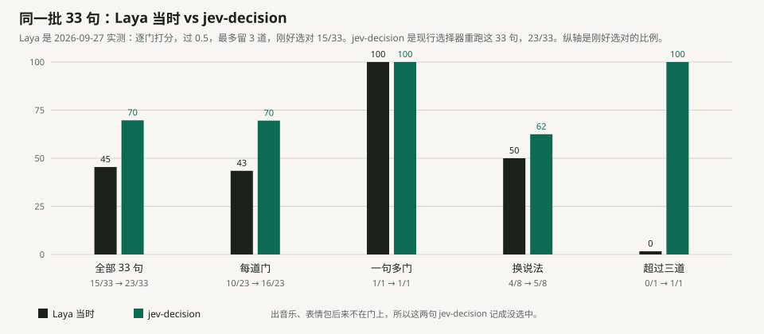
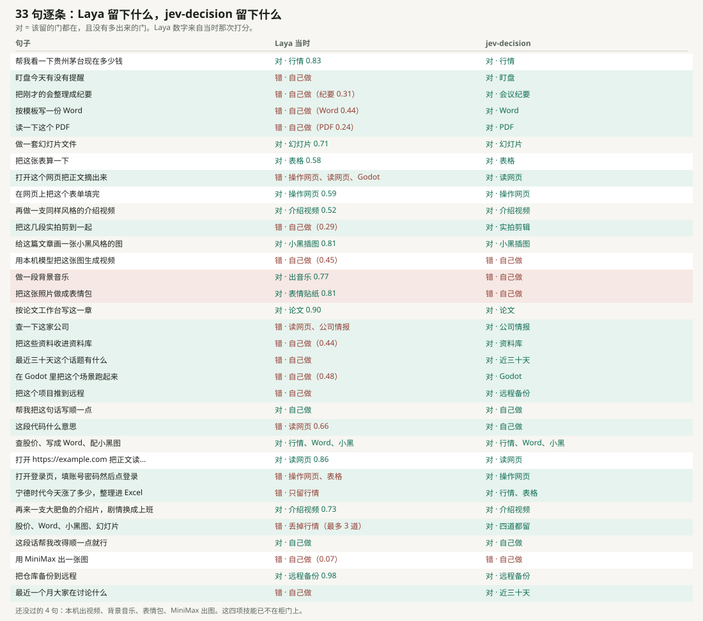
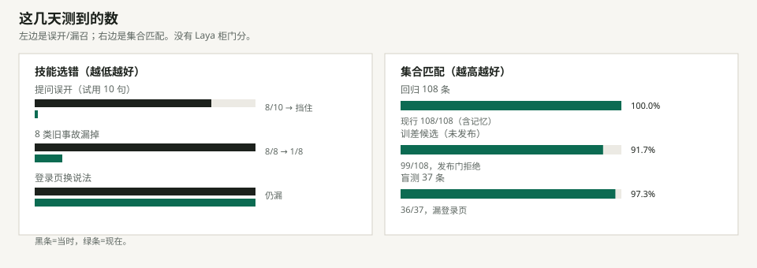
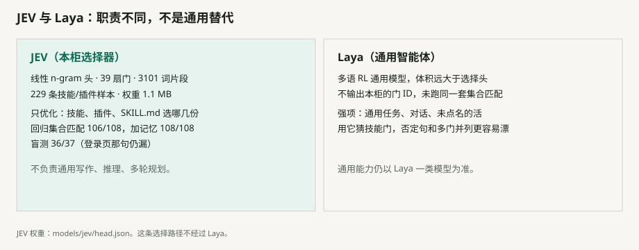

# 技能柜

本地技能柜。它把你机器上已有的技能复制进这个项目。每一句话先交给本机的 JEV 打分。柜门上每一项单独问要不要用。句子里写了这项、并且过线的都留下；写了不要的那项除外。一份都不要就自己做。模型打开时结果已经定好，它照做，不再挑选。原来的技能目录不会删除。

JEV 选的是技能和能点名的插件。MCP 只在柜子里查看和管理，不参与挑选。

技能副本、调用记录和个人配置都留在本机，不在这个仓库里。仓库里有选择器权重 `models/jev/head.json`。

## 展示


## 运行

```bash
python -m venv .venv
.venv\Scripts\python -m pip install -r requirements.txt
.venv\Scripts\python web\server.py
```

打开 <http://127.0.0.1:8765/>。选择器读 `models/jev/head.json`。重新训练用 `.venv\Scripts\python -m host.train_jev`。

## 别人的技能在哪

知道技能文件夹在哪，就在设置里选它或粘贴路径。程序把里面的技能复制进项目，原来的文件夹不删。

不知道在哪，再点「全局搜索技能」。它会查找常见的 Cursor、OpenClaw、Hermes、Codex、Claude 技能目录，以及用户主目录里的项目。同名的只保留一份。

## JEV

选择器是本机训出来的门打分头，权重在 `models/jev/head.json`：39 扇门、3101 个词片段、229 条技能/插件样本，约 1.1 MB。这是已发布的基线，不要假设 `python -m host.train_jev` 会得到同一份文件。样本表可以比权重新。

它只针对智能体在技能、插件和 SKILL.md 上的选择做优化：句子里点了名、并且过线的门留下，写了不要的关掉。通用写作、推理、未点名的活仍比不上 Laya 一类通用模型，也不该拿 JEV 去替代它们。

下面几张图是这几天实际踩过的坑：**当时怎样，JEV 现在怎样**。跟 Laya 比的是职责（技能选择 vs 通用能力），没有给 Laya 打柜门分——它不输出柜门 ID，仓库里也没有权重。





提问误开（Codex 试用 10 句里 8 句开门）、否定被盖掉、未点名却开、赢家通吃、WordPress 当成 Word、不要 PDF 却漏论文、填表只开 PDF。这些现在挡住了。盲测「在登录页填完再点提交」还漏。一次重训把回归打到 99/108，发布门拒绝了，基线没被覆盖。





- 训练：`.venv\Scripts\python -m host.train_jev`。候选权重写在 `head.candidate.json` 上评测，回归不下降且提问/否定/核心句不破才替换 `head.json`。对比写在 `models/jev/last-train.json`。要强行覆盖用 `--force`。
- 样本按柜门上的说法来写。`tests/eval_cases.json`、`tests/eval_blind.json` 和十二句考卷都不放进训练集；修召回用近义句，不用评测原句

## 调用记录

每次选择都会记下任务、类型和用到的技能。在结果上或「调用」里可以：

- 去掉或换掉一个技能：只记住这一句话，以及以后很像的说法。不会让整个分类都跟着变
- 再加一个技能：同样只记在这句话上
- 删掉记录：只去掉这一行，已经记住的调整还在

换一种说法、意思接近时，也会沿用这次调整。结果上会写明沿用了哪一句。

JEV 在模型开口之前打一遍分。门上每一项单独问要不要用，例如行情、文件、浏览器、介绍视频、论文。句子里写了这项、并且过线的一起留下。写了不要的那项除外。只教模型怎么想的技能留在柜子里，不进这道题。

- 自己做：这次不读技能
- 调用技能：读完选定的那几份，照做，不再挑选

## 接入

别人要把自己的宿主接到这个柜上，按 [INTEGRATION.md](INTEGRATION.md) 做。模型开口之前把原句交给柜，柜返回已经定好的结果。网页上的 MCP 配置只用来读取已经选定的技能正文，不能用来挑选。

## 技能库

「库」里每天从 GitHub 取星标最高、话题是 agent-skills 的 10 个仓库。只是推荐，不会自动安装。

推荐在页面最上。仓库名和里面的技能都能点开原链接。贴 GitHub 链接的输入框在标题那一行。柜会把里面的 SKILL.md 复制进来，不运行脚本。OpenClaw 和 Hermes 已经接在这个柜上时，下次任务直接用这份副本。

## OpenClaw、Hermes、Codex、DeepSeek Harness

接上之后，这几家不再自己在柜子里翻技能、猜该用哪一份。模型开口前（Hermes `pre_llm_call`、OpenClaw `before_prompt_build`、DeepSeek Harness `agent/pre-step`）先把原句交给本机 JEV：该自己做还是该用哪几份技能、哪几个点了名的插件，结果已经写在前言里。原句不拆、否定项会关掉、解释类问题不会当成操作。模型只执行这个结果。

因此宿主侧少了三件常见事故：把「不要 Word」又打开成 Word、把「PDF 是什么」当成导出 PDF、把一句里的会议纪要和 Word 收成只留一个赢家。技能正文来自本机副本，原来的技能文件夹不会被删。MCP 只补读已经选定的正文，不能改选。

DeepSeek Harness 兼容两种接法，可以同时用：

- 插件：GUI「设置 → 插件 → 添加插件」填 `D:\jev-decision-kit\host\harness_plugin`（`desktop` profile 不能走 CLI），装完重启 App 再开新会话。其它 profile 可用 `dsh plugin add <本项目>\host\harness_plugin`
- MCP：把 `jev-skill-kit` 加进 MCP 列表，用前言里的 `decision_id` 调用 `get_skill` 续读正文

Codex 目前仍走 MCP 补读。完整「先选再开口」按 [INTEGRATION.md](INTEGRATION.md)。打开网页不会改这些宿主的配置；只有在设置里点保存时才会同步 Hermes 和 OpenClaw 的 MCP 读写项。关掉选择器后，Hermes、OpenClaw 和 DeepSeek Harness 插件不再把这句话交给 JEV。
